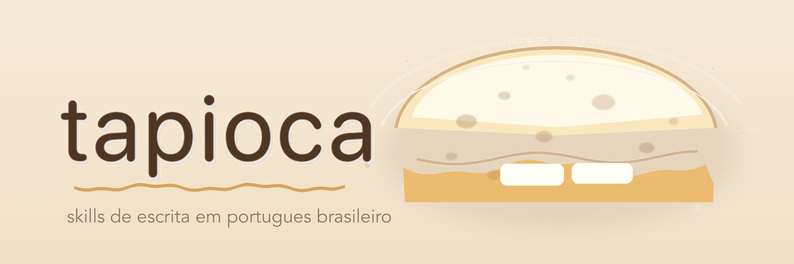

<p align="center">
  
</p>

<h1 align="center">tapioca</h1>

<p align="center">
  <em>Um repositório central de skills, agents e MCPs pro Claude Code e Cursor.</em>
</p>

<p align="center">
  <a href="https://github.com/gabriel-dantas98/tapioca/actions"></a>
  <a href="./LICENSE"></a>
  
  
</p>

---

tapioca é o lugar único onde minhas capabilities de IA reusáveis moram: skills, agents e (em breve) MCPs, versionados e validados, instaláveis nos dois alvos: Claude Code e Cursor.

A ideia é tratar tooling de IA como um platform engineer trata tooling interno. Em vez de espalhar skill solta por repo, centraliza num só lugar com manifesto, CI e padrão de contribuição. Um "internal developer platform", só que pra capabilities de agente. A massa (`tapioca`) é neutra; os recheios mudam. Hoje o conteúdo é PT-BR. Amanhã pode ser qualquer domínio.

## Como funciona

- **Distribuível nos dois formatos.** [Claude Code Plugin](https://code.claude.com/docs/en/plugins) e [Cursor Plugin](https://cursor.com/docs/reference/plugins), com manifestos sincronizados em `.claude-plugin/` e `.cursor-plugin/`.
- **Guidance vendor-neutral.** `.agents/` é a fonte de verdade (constituição, regras, harness de teste); `AGENTS.md`/`CLAUDE.md` são routers finos. Ver [`.agents/README.md`](.agents/README.md).
- **Validado por CI.** Cada skill nova passa por validação de manifesto, conformância e smoke test nos dois CLIs antes de entrar.

## Skills incluídas

### `/tapioca:multi-gen`

Dispara vários CLIs de IA em paralelo (mínimo `codex` e `cursor-agent`) a partir de um briefing de imagem, valida cada saída (SVG bem-formado) e monta um preview HTML comparativo com painel claro, escuro e tira de favicons (16/32/48/180px) pra escolher o vencedor antes do refino manual.

- Dispatch paralelo com timeout portável (macOS sem `gtimeout`)
- Pré-check de auth do `cursor-agent` (vira SKIP em vez de travar)
- Extração robusta do `<svg>` quando o CLI mistura log na stdout

```text
/tapioca:multi-gen "logo geometrico p/ Novarum, paleta azul" --palette "#2E5BFF,#FFFFFF"
```

### `/tapioca:usabilidade-br`

Audita usabilidade de apps web contra as 10 heurísticas de Jakob Nielsen. Captura evidência via Chrome MCP, opcionalmente correlaciona com código fonte (`--code <path>`) e gera um HTML report local self-contained com score por heurística, screenshots embutidas, snippet com `file:line` e um **fix prompt copiável** por violação.

```text
/tapioca:usabilidade-br http://localhost:3000 --code ./src
```

### `/tapioca:humanizer-br`

Remove traços de escrita gerada por IA em PT-BR e injeta voz humana real. Catálogo de 25+ padrões: linguagem promocional, gerúndios empilhados, paralelismo negativo, regra dos três, Title Case herdado do inglês, aspas curvas, ganchos dramáticos, rastros de chatbot, e mais. Roda 100% no Claude/CLI, sem API key externa. Aceita voice preset opcional pra calibrar a voz. Companion agent faz multi-pass com autoavaliação.

```text
/tapioca:humanizer-br Cole aqui o texto pra humanizar.
```

## Instalação

### Claude Code

```text
/plugin marketplace add gabriel-dantas98/tapioca
/plugin install tapioca@tapioca
```

### Cursor

Settings → Plugins → Add marketplace → `gabriel-dantas98/tapioca`, depois instale o plugin `tapioca` pela lista. O repo carrega o manifesto do Cursor em `.cursor-plugin/` com a mesma `skills/` e `agents/` por baixo.

### Claude Desktop

O Desktop não consome plugin nem marketplace — empacote a skill avulsa e suba em Settings → Capabilities → Skills:

```bash
zip -r humanizer-br.zip skills/humanizer-br/
```

Só `humanizer-br` é portável; as outras dependem de CLIs e Chrome MCP.

### Via --plugin-dir (desenvolvimento)

```bash
claude --plugin-dir /caminho/para/tapioca
```

## Estrutura

```text
tapioca/
├── .claude-plugin/{plugin,marketplace}.json   # manifestos Claude Code
├── .cursor-plugin/{plugin,marketplace}.json   # manifestos Cursor
├── .agents/                # guidance canônica (constituição, regras, harness)
├── skills/                 # componentes shippados (recheios)
│   ├── humanizer-br/
│   ├── usabilidade-br/
│   └── multi-gen/
├── agents/                 # agent companions
├── docs/                   # site GitHub Pages
└── .github/workflows/      # CI de validação
```

## Contribuindo com uma skill

1. `skills/<nome>/DESIGN.md` primeiro (Goal · Non-goals · Inputs · Outputs · Voice · Open questions).
2. `skills/<nome>/SKILL.md` com frontmatter `name` + `description`.
3. Registre nos manifestos (`.claude-plugin` + `.cursor-plugin`).
4. Adicione ao harness de smoke (`.agents/skills/smoke-test-skills/`) com verificador determinístico.
5. CI valida tudo no PR.

As leis do repo estão em [`.agents/constitutions/constitution.md`](.agents/constitutions/constitution.md).

## Roadmap

| Versão | Conteúdo |
|---|---|
| **v0.1** | `humanizer-br` (skill + agent), formato de plugin |
| **v0.2** | `usabilidade-br` + `multi-gen`; marketplace Claude Code + Cursor; `.agents/` standardization; CI de validação |
| v0.3 | Suporte a MCPs no manifesto + primeira MCP no catálogo |
| v0.4 | Submissão aos marketplaces oficiais (Anthropic + Cursor) |

## Crédito

A skill `humanizer-br` descende de duas linhagens:

- [blader/humanizer](https://github.com/blader/humanizer) (MIT, ~19k stars) — humanizer canônico **em inglês** para Claude Code e OpenCode. Estabeleceu o padrão skill + voice calibration que esta skill estende.
- [mackswendhell/humanizer-pt-br](https://github.com/mackswendhell/humanizer-pt-br) (MIT, 2026) — primeira adaptação direta do catálogo do WikiProject AI Cleanup para **PT-BR**.

## Licença

MIT — ver `LICENSE`.
