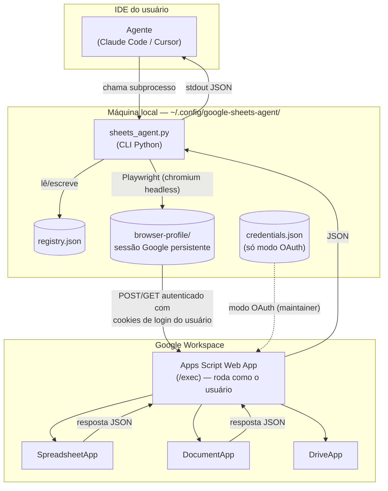
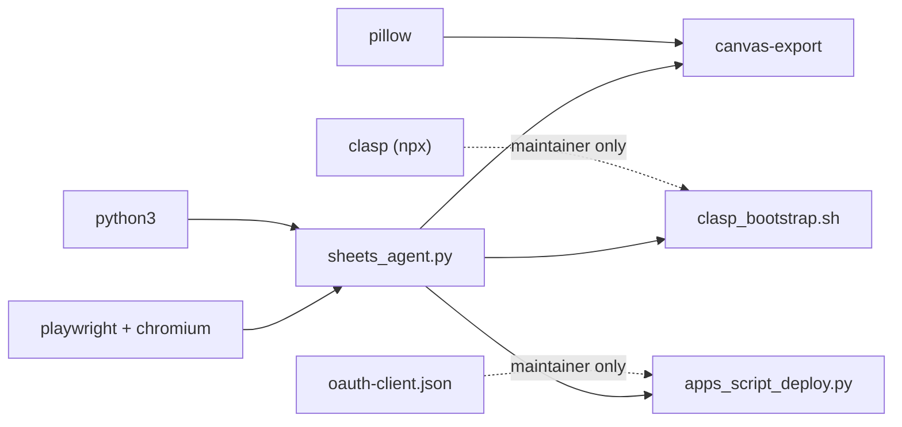
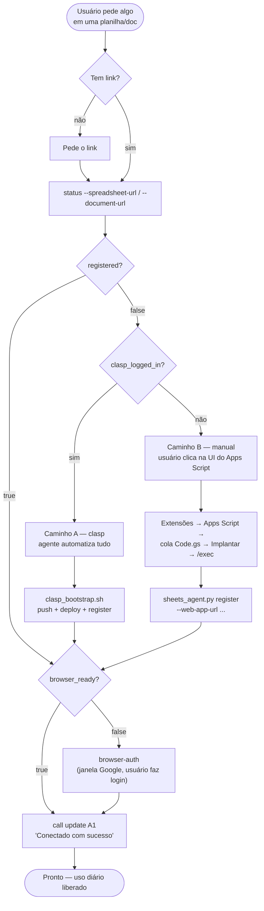
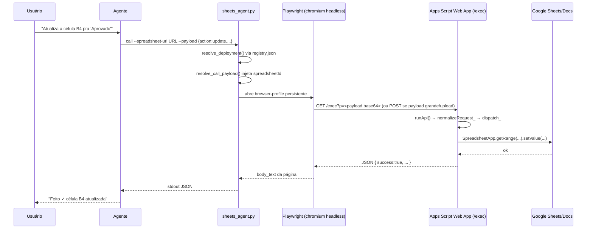
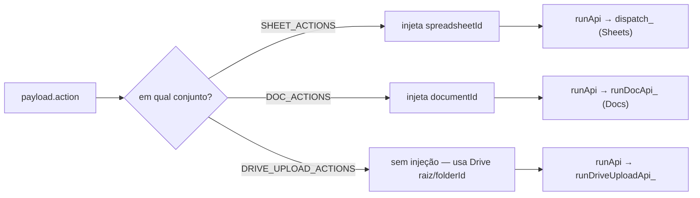

# Arquitetura — google-sheets-apps-script

Guia de referência para o time: arquitetura completa, dependências, e os dois fluxos que importam — como uma planilha ou documento é conectado pela primeira vez, e o que acontece a cada chamada depois disso.

> Fonte de verdade contínua para comportamento do agente: [SKILL.md](SKILL.md), [wizard.md](wizard.md), [reference.md](reference.md), [docs-reference.md](docs-reference.md), [DESIGN.md](DESIGN.md). Este documento é a visão técnica/arquitetural para o time, não instruções de agente.

---

## 1. Visão geral

É uma skill do Claude Code / Cursor que deixa o agente editar **Google Sheets** e **Google Docs** em nome de um usuário não técnico, sem que esse usuário precise abrir o GCP Console, gerar credenciais OAuth ou tocar em terminal. O agente roda todo o CLI; o usuário só cola links e clica na UI do Google quando pedido.

Tecnicamente, isso é resolvido publicando um **Google Apps Script** como Web App dentro da própria planilha ou documento do usuário (rodando com a identidade dele, sem custo de infra) e falando com esse Web App via um perfil de navegador Playwright persistente — **sem precisar de projeto GCP nem de OAuth client por usuário**. Existe um caminho OAuth paralelo, mas é reservado para maintainers que fazem deploy automatizado via API.

| | |
|---|---|
| **Google Sheets** | CRUD de células, estilo, comentários, abas e operações em lote (`batch`). |
| **Google Docs** | Markdown-first: `appendMarkdown`, tabelas, imagens, abas de documento, comentários nativos. |

---

## 2. Arquitetura



O agente nunca fala direto com a API do Google. Toda chamada passa pelo CLI, que decide entre modo **browser** (padrão, usa a sessão logada do usuário) e modo **oauth** (só maintainer, via Apps Script API).

Ponto central do design: o Web App do Apps Script roda com as **permissões do próprio usuário** sobre aquela planilha/documento específico — não existe uma conta de serviço com acesso amplo ao Workspace. Isso é o que permite pular o GCP Console: cada usuário "implanta" o script uma vez dentro do próprio arquivo (via clique na UI do Google ou via `clasp` automatizado), e a partir daí o CLI só precisa saber a URL desse deploy.

---

## 3. Dependências

| Camada | Dependência | Papel |
|---|---|---|
| Runtime | `python3` (3.10+) | Executa `sheets_agent.py`; único hard requirement de máquina. |
| Runtime | `playwright` + Chromium | Abre o perfil de navegador persistente para autenticar e chamar o Web App como o usuário logado. |
| Runtime | `pillow` | Usado pelo `canvas-export` para renderizar manifest JSON → PNG. |
| Deploy (maintainer) | `@google/clasp@2.4.2` via `npx` | Push do `Code.gs` + arquivos `.gs` e deploy do Web App sem passar pela UI do Apps Script. |
| Deploy (maintainer, alternativo) | OAuth client (`config/oauth-client.json`) | Caminho via Apps Script API (`apps_script_deploy.py`) quando `clasp` não está disponível. |
| Google | Apps Script Web App | O único componente que roda "na nuvem" — dentro da conta Google do usuário, não da infra do time. |
| Google (Docs) | Advanced Service: **Docs API** | Necessário no projeto Apps Script para `listDocTabs` / `createDocTab` / `renameDocTab` (abas de documento). |
| Distribuição | Gist público ou plugin **tapioca** | Duas formas de instalar a skill; ambas compartilham o mesmo `~/.config/google-sheets-agent/`. |

> Não há dependência de infraestrutura própria do time (sem servidor, sem banco, sem conta de serviço central). Todo estado "vivo" mora na máquina do usuário (`registry.json`, sessão do browser) e no projeto Apps Script dentro do próprio arquivo Google.



Linhas pontilhadas = só usadas por quem faz deploy/manutenção do script; o usuário final nunca toca nelas.

---

## 4. Onboarding — conectando uma planilha/doc pela 1ª vez

O wizard ([wizard.md](wizard.md)) roda uma pergunta por turno; o agente decide o próximo passo consultando `status`.



Caminho A (clasp) é preferido quando o maintainer já está logado no `clasp`: o agente empurra o código e publica sozinho. Caminho B é o fallback 100% clique-e-cola para quando não há `clasp` disponível.

### Passo a passo (visão do usuário)

| Passo | Ação |
|---|---|
| 0 | **Boas-vindas** — "já tem planilha ou quer criar uma nova?" |
| 1 | **Cola a URL** — agente roda `status` + `parse` para extrair o ID. |
| 2 | **Conecta o script** — via `clasp` (agente) ou clique manual em Extensões → Apps Script → Implantar (usuário). |
| 3 | **Login no Google** — só se a sessão do browser Playwright ainda não existir. |
| 4 | **Célula de teste** — agente escreve "Conectado com sucesso" em A1 e pede confirmação visual. |

> Regra dura do skill: **nunca chamar `call` numa planilha com `registered: false`**. Toda ação passa antes pelo `status`.

---

## 5. Uso diário — anatomia de uma chamada

O que acontece entre o agente pedir `{"action":"update", ...}` e a célula mudar na planilha.



Payloads pequenos viajam como querystring em `GET` (mais rápido); payloads grandes ou uploads de arquivo viram `POST` automaticamente (limite de ~7000 chars ou ações de upload).

### Roteamento de ação — Sheets vs Docs vs Drive

Uma única URL de deploy pode atender **tanto planilha quanto documento** ("shared deploy") — o roteamento não é pela URL usada na chamada, é pelo `action` do payload. O CLI classifica cada ação em três conjuntos (`SHEET_ACTIONS`, `DOC_ACTIONS`, `DRIVE_UPLOAD_ACTIONS`) e injeta o `spreadsheetId` ou `documentId` certo antes de enviar.



---

## 6. Registry & estado local

`~/.config/google-sheets-agent/registry.json` é a única fonte de verdade sobre quais planilhas/docs estão conectados e qual deploy usar para cada um. Ele é **compartilhado entre IDEs**: registrar uma planilha no Cursor a deixa disponível no Claude Code, e vice-versa.

```json
{
  "spreadsheets": {
    "<spreadsheetId>": {
      "scriptId": "...",
      "label": "Financeiro Q3",
      "latestDeploymentId": "AKfycb...",
      "latestWebAppUrl": "https://script.google.com/.../exec",
      "deployments": { "AKfycb...": { "webAppUrl": "...", "registeredAt": 1234 } }
    }
  },
  "documents": { "<documentId>": { "...": "mesma forma" } },
  "deployments": { "AKfycb...": { "spreadsheetId": "...", "webAppUrl": "...", "isLatest": true } }
}
```

| | |
|---|---|
| **registry.json** | Mapa spreadsheetId/documentId → deployment. Suporta múltiplos deploys históricos por recurso; sempre resolve para o `latestDeploymentId`. |
| **browser-profile/** | Perfil Chromium persistente do Playwright — guarda os cookies de login Google do usuário. É isso que substitui OAuth por usuário. |

Se só existe **um** recurso registrado no total, o CLI dispensa `--spreadsheet-url`/`--document-url` nas chamadas seguintes — resolve sozinho por ser o único candidato.

---

## 7. Capacidades por tipo de recurso

### Sheets — células, abas, estilo

| Ação | Propósito | Campos-chave |
|---|---|---|
| `read` | ler valores/fórmulas/notas | `range`, `sheetName?` |
| `update` | escrever célula(s) | `range`, `value`/`values` |
| `create` | adicionar linha | `values`, `row?` |
| `delete` | limpar/remover linhas | `range`, `row`, `rows[]` |
| `style` | formatação | `style: {bold, background, fontColor, ...}` |
| `comment` | nota na célula | `range`, `text` |
| `listSheets` / `createSheet` / `renameSheet` / `deleteSheet` / `tabColor` | gestão de abas | `name`, `tabColor`, `index` |
| `batch` | várias ops numa chamada | `ops: [...]` |

### Docs — conteúdo, comentários, abas de doc

| Ação | Propósito |
|---|---|
| `appendMarkdown` | **preferida** — renderiza markdown (headings, listas, bold, links, tabelas, imagens) em estilo nativo do Docs |
| `appendTable` | array 2D → tabela estilizada |
| `appendImage` / `uploadAndAppendImage` | imagem por URL pública, `driveFileId`, ou upload local direto |
| `readDoc` / `listDoc` | leitura de texto/estrutura |
| `insertDoc` / `replaceDoc` / `styleDoc` / `deleteDoc` | edições cirúrgicas |
| `readDocComments` / `replyDocComment` / `resolveDocComment` | comentários nativos do Google Docs (thread + resposta com atribuição de host) |
| `listDocTabs` / `createDocTab` / `renameDocTab` | abas organizacionais de documento (requer Docs API advanced service) |

> `replyDocComment` sempre inclui atribuição de host (`"host":"cursor"` ou `"host":"claude"`, auto-detectado por env var se omitido) — o Apps Script anexa `"\n\n> replied from {host}"` na resposta. Isso existe para deixar rastreável qual agente respondeu o quê.

---

## 8. Deploy do Apps Script (maintainer)

Como o código `.gs` chega dentro do projeto Apps Script do usuário.

```mermaid
flowchart TD
    TRIGGER["clasp_bootstrap.sh --spreadsheet-url ... --script-id ..."] --> LOGGEDIN{"clasp logado?"}
    LOGGEDIN -- não --> FAIL["exit — pede 'npx clasp login'"]
    LOGGEDIN -- sim --> COPY["copia Code.gs + Docs.gs +<br/>MarkdownDoc.gs + CommentsDoc.gs +<br/>DriveUpload.gs + DocTabs.gs +<br/>appsscript.json → clasp/ workdir"]
    COPY --> HASID{"tem script-id?"}
    HASID -- não, --create-project --> CLASPCREATE["clasp create<br/>(novo projeto vinculado)"]
    HASID -- sim --> PUSH
    CLASPCREATE --> PUSH["clasp push --force"]
    PUSH --> DEPLOY["clasp deploy<br/>(nova versão ou --update-only)"]
    DEPLOY --> URL["monta Web App URL<br/>(.../macros/s/{deploymentId}/exec)"]
    URL --> REGISTER["sheets_agent.py register<br/>grava no registry.json"]
```

Esse é o caminho automatizado (npx `@google/clasp@2.4.2`). O caminho manual pula direto para "register", com o usuário colando a URL `/exec` depois de implantar pela UI do Apps Script.

Existe um segundo caminho de deploy — `apps_script_deploy.py` via `bootstrap` — que usa a **Apps Script API** com OAuth em vez de `clasp`. É o mesmo resultado final (script publicado + registrado), mas usado quando o maintainer prefere não depender do Node/npx.

---

## 9. Mapa de arquivos da skill

`skills/google-sheets-apps-script/` — o que cada arquivo faz.

```text
SKILL.md              — instruções que o agente lê (regras, fluxo de decisão)
wizard.md              — mensagens de onboarding PT-BR, uma pergunta por turno
reference.md            — catálogo de actions + troubleshooting (Sheets)
docs-reference.md       — spec de markdown/tabelas/imagens (Docs)
canvas-export-reference.md — manifest JSON → PNG
DESIGN.md               — goal, non-goals, inputs/outputs
config/
  oauth-client.json.example — template do client OAuth (maintainer)
templates/            — fonte .gs que vira o Web App do usuário
  Code.gs                — runApi/doGet/doPost, dispatch de ações Sheets
  Docs.gs, MarkdownDoc.gs, CommentsDoc.gs,
  DriveUpload.gs, DocTabs.gs
  appsscript.json         — manifest (advanced services: Docs API)
scripts/
  sheets_agent.py       — o CLI (status, register, call, upload, canvas-export...)
  apps_script_deploy.py   — bootstrap via Apps Script API (OAuth)
  clasp_bootstrap.sh      — bootstrap via clasp (push+deploy+register)
  setup.sh                — instala python deps + chromium
  canvas_export/           — export de manifest → PNG, sem acoplamento a Google
  publish_gist.sh          — sincroniza esta pasta → gist público
evals/                — testes estáticos + integração (live Google)
```

---

## 10. Segurança & limites

O que o design deliberadamente evita:

- O Web App roda **"Executar como: Eu" / "Quem pode acessar: Somente eu"** — o script só age dentro do que o próprio usuário já tem acesso, não é uma conta de serviço ampla.
- Nenhum token OAuth por usuário final: a autenticação é a sessão de navegador Playwright, que expira como qualquer sessão Google normal (daí o fluxo `browser-auth` de "sessão expirou, logo de novo").
- O caminho OAuth (`signin`/`bootstrap`) é **maintainer-only** — nunca exposto ao usuário final; serve só para automatizar deploy via Apps Script API.
- Ações destrutivas (`deleteSheet`, sobrescrever range com dados) são **gate** por confirmação explícita no wizard — não são bloqueadas tecnicamente, é uma regra de comportamento do agente.
- Compartilhamento de upload no Drive é escopado por domínio (`--share-domain`, default do time), não público por padrão.

---

## 11. Erros comuns

| Sintoma | Causa | Correção |
|---|---|---|
| Redireciona pra tela de login | sessão do browser-profile expirou | `browser-auth` de novo |
| `Unknown action: listSheets` | script no arquivo do usuário está desatualizado | `clasp_bootstrap.sh --update-only` ou reimplantar manual |
| `permission to call DocumentApp` | escopo de Docs nunca foi autorizado nesse script | `authorize --auto` (roda `authorizeWorkspace` uma vez) |
| "Sheet already exists" | nome de aba duplicado | perguntar ao usuário: usar existente ou outro nome |
| Web app "not found" | URL `/exec` antiga após reimplantar | `register` com a nova URL |
| Playwright ausente | máquina nova, setup não rodou | `setup.sh` (instala playwright + chromium) |
